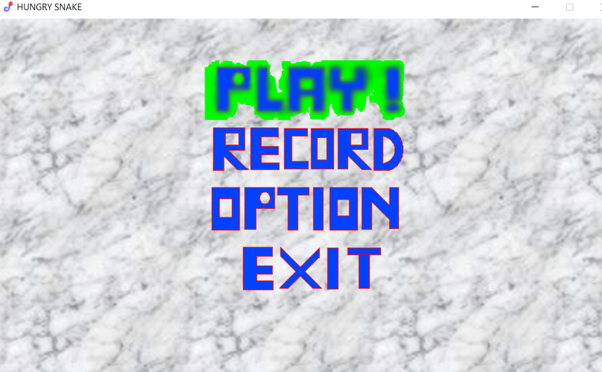
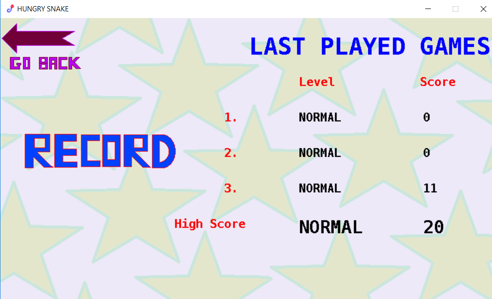
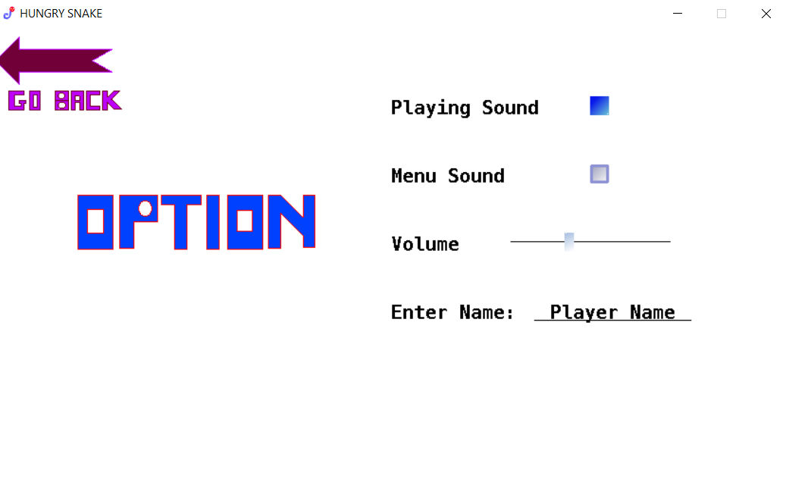
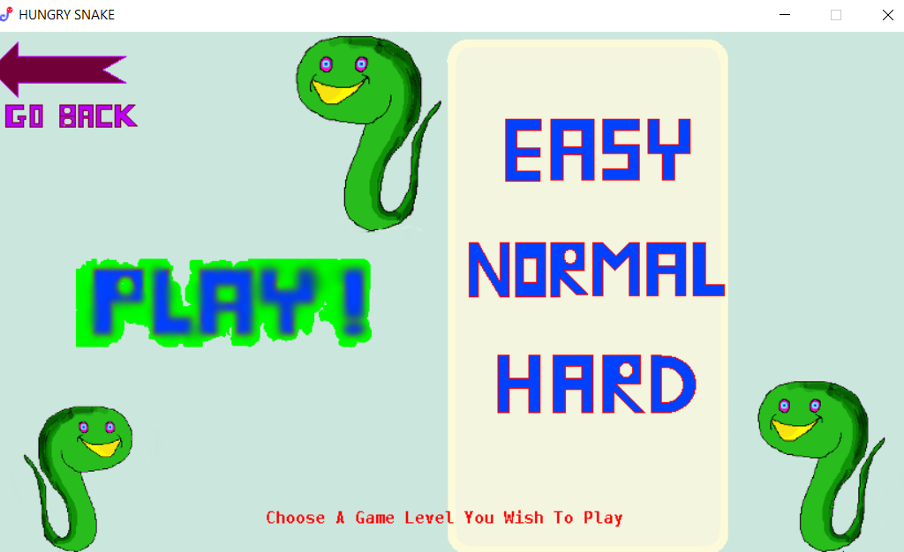

# Hungry-Snake-Game
Simple snake game written using C++ and SDL

Control the snake using up/down/left/right arrow buttons. Avoid bombs and the monster. Note that both snake and monster can grow after eating an apple. Bombs are generated randomly each time we play.

Here is the beginning scene. We have 4 options.

The record includes the history of past scores. These scores are stored in a text file.

This option allows us to turn on/off sound or adjust its volume. 

This game has three levels: easy, normal, and hard. The speed of the monster is different depending on each level. Also, there are more bombs when the difficulty level increases.

